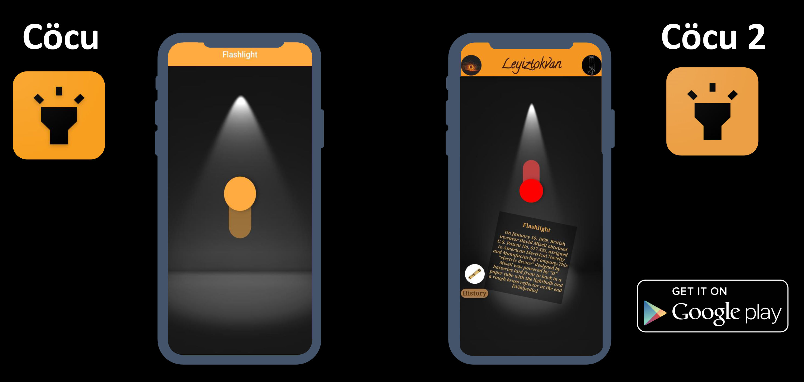

# Cöcu - Version_2

**Flashlight App** with a minimal design

## Project Overview

This project was created as a beginning step in learning how to develop mobile applications using Flutter and the Dart programming language for a high school project. The goal is to acquire solid skills to be able to 
create an interactive mobile app template for an "e-commerce" app for smartphones, see project here [Çik](https://github.com/Leyiztokvan/cik_app).

## Ressource

A few resources to get you started if this is your first Flutter project:

- [Write your first Flutter app](https://flutter.dev/docs/get-started/codelab): Learn the basics of Flutter by creating an app that works on mobile, desktop, and web.
- [Useful Flutter samples](https://flutter.dev/docs/cookbook): contains recipes that demonstrate how to solve common problems while writing Flutter apps.
- [Flutter documentation](https://flutter.dev/docs): which offers tutorials,
samples, guidance on mobile development, and a full API reference.
